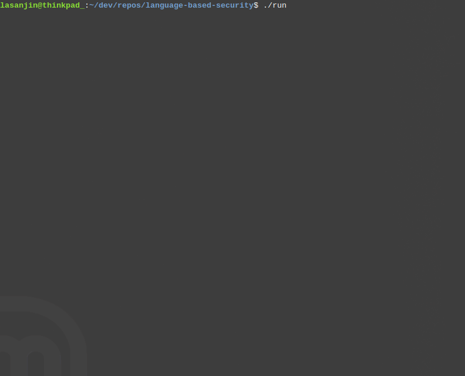

# Language-Based Security
Project from Language-Based Security course at Chalmers.

## How to run
- Execute script
```
$ ./run run all 
```

- DIY
  1. Run Spring Boot application [SecureLogin](../SecureLogin)
     - `mvn -f SecureLogin/ spring-boot:start`
  2. Execute brute-force attack(s)
     - `./attacks/bruteforce.py`
     - `./attacks/multithreaded_bruteforce.py`
  3. Kill Spring application
     - `ps aux | grep SpringApplication | awk 'NR==1{print $2}' | xargs kill -9`


## Demo

