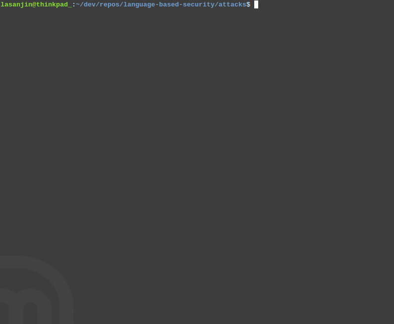

# Automated attacks
Brute-force attacks with wordlists from [SecList](https://github.com/danielmiessler/SecLists), designed to target [SecureLogin](../SecureLogin) application. Both attacks extract session cookie and csrf token. They also assume that the username is known (This can be modified fairly easy).


## Description
### [`brutforce.py`](bruteforce.py)
 - Single threaded brute-force attack

### [`multithreaded_bruteforce.py`](multithreaded_bruteforce.py)
 - Multithreaded brute-force attack


## How to run
1. Run Spring Boot application [SecureLogin](../SecureLogin)
   - Brute-force countermeasure should be disabled by default in [`CustomUserDetailsService.java`](../SecureLogin/src/main/java/com/group36/securelogin/service/CustomUserDetailsService.java)

2. Execute brute-force attack(s)
```
$ ./bruteforce.py
$ ./multithreaded_bruteforce.py
```


## Demo
